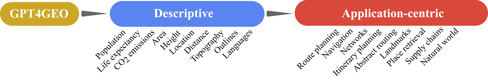
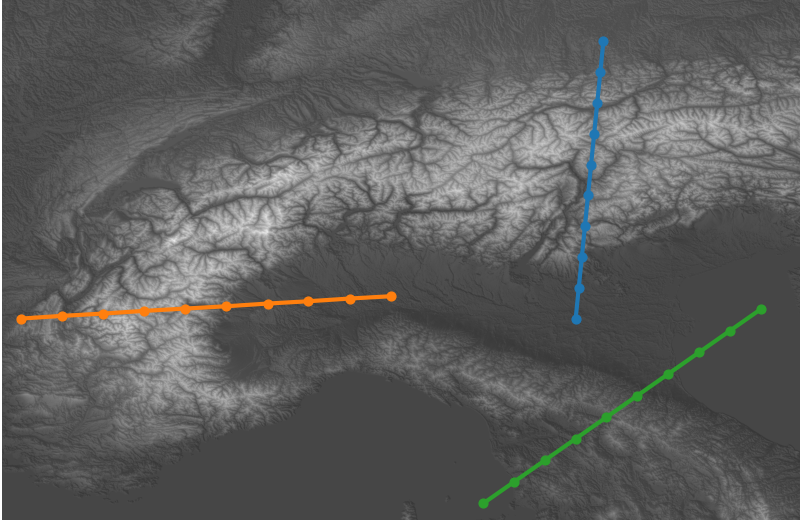
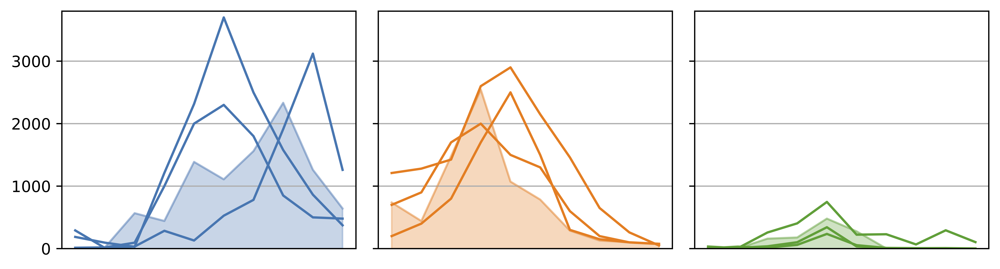
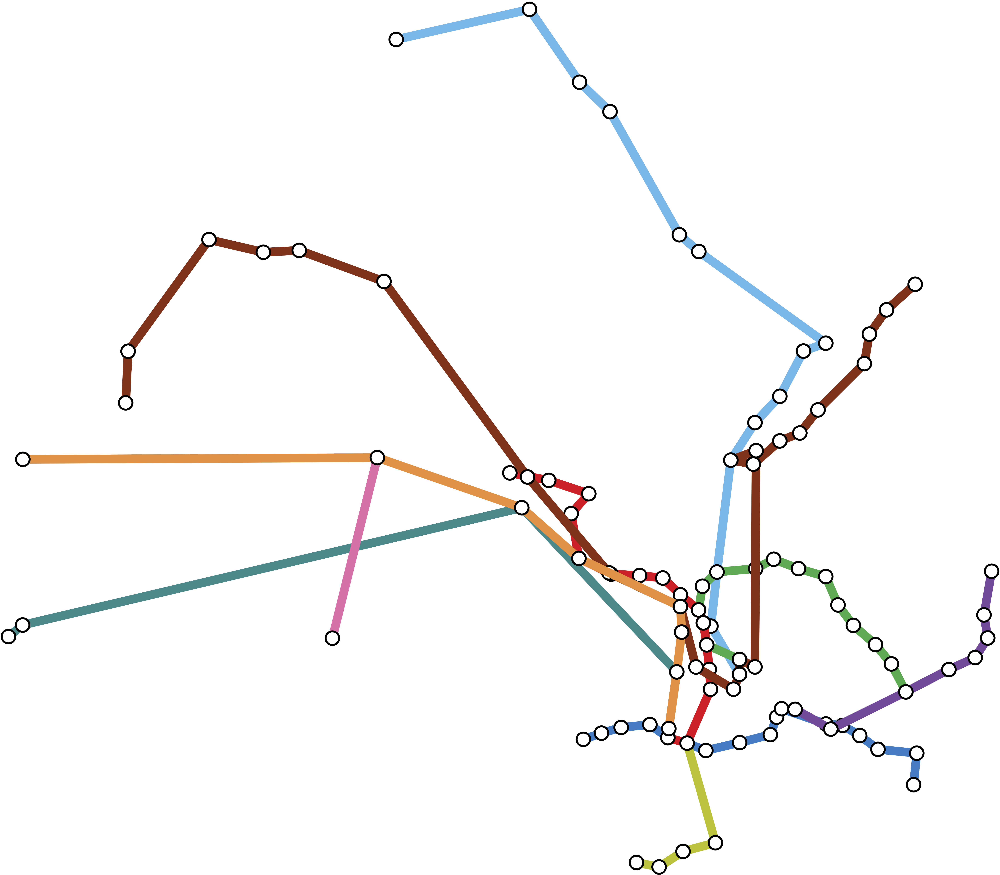
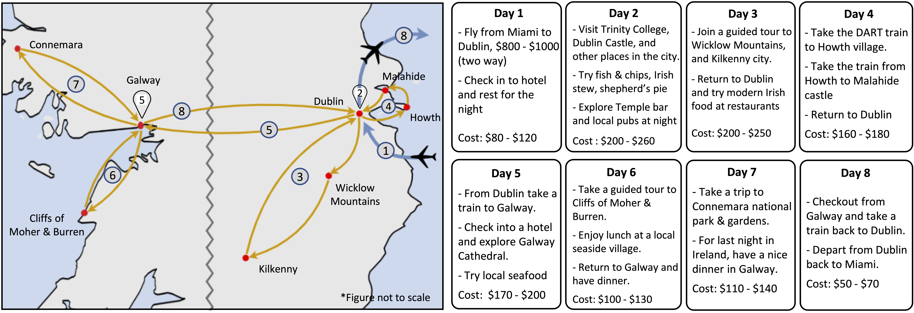

# GPT4GEO 🌍 🗺️ 🧭

[**GPT4GEO: How a Language Model Sees the World's Geography**](https://arxiv.org/abs/2306.00020)

Jonathan Roberts, Timo Lüddecke, Sowmen Das, Kai Han, Samuel Albanie

GPT4GEO provides a broad categorisation of the geographic capabilities of GPT-4 and what it knows about the world *without access to the Internet*. This repo is structured as follows, including the prompts for the GPT4GEO project experiments:

- [GPT4GEO 🌍 🗺️ 🧭](#gpt4geo--️-)
  - [Taxonomy](#taxonomy)
  - [Highlights](#highlights)
    - [Plot country outlines](#plot-country-outlines)
    - [Plot mountain topographies](#plot-mountain-topographies)
    - [Map transport networks](#map-transport-networks)
    - [Navigate complex routes across multiple timezones...](#navigate-complex-routes-across-multiple-timezones)
    - [And many more...!](#and-many-more)
  - [Prompts](#prompts)
    - [Descriptive Experiments](#descriptive-experiments)
      - [Population, life expectancy and CO2 emissions](#population-life-expectancy-and-co2-emissions)
      - [Area and height](#area-and-height)
      - [Location](#location)
      - [Distance](#distance)
      - [Topography](#topography)
      - [Outlines](#outlines)
      - [Languages](#languages)
    - [Application-Centric Experiments](#application-centric-experiments)
      - [Route planning](#route-planning)
      - [Navigation](#navigation)
      - [Networks](#networks)
      - [Itinerary planning](#itinerary-planning)
      - [Landmarks](#landmarks)
      - [Multi-criteria place retrieval](#multi-criteria-place-retrieval)
      - [Supply chains](#supply-chains)
      - [Natural world](#natural-world)
  - [Citation](#citation)
  - [Questions](#questions)

## Taxonomy

<table>
  <tr>
    <td valign="top"></td>
   </tr> 
    <td align="center">GPT4GEO Experiments Taxonomy.</td>
</table>

## Highlights

GPT-4 knows a surprising amount about the world and is able to:


### Plot country outlines
<table>
  <tr>
    <td valign="top"></td>
   </tr> 
    <td align="left">GPT-4's Australia outline prediction from a single prompt and after 6 steps of improvement through dialogue.</td>
</table>


### Plot mountain topographies
<table>
  <tr>
    <td valign="top"></td>
    <td valign="top"></td>
  </tr>
  <tr>
    <td align="center" valign="top">Satellite imagery with trajectories.</td>
    <td align="center" valign="top">Predicted (lines) and actual (shaded areas) topographies.</td>
  </tr>
</table>


### Map transport networks
<table>
  <tr>
    <td valign="top"></td>
    <td valign="top"></td>
  </tr>
  <tr>
    <td align="center" valign="top">GPT-4.</td>
    <td align="center" valign="top">Ground Truth (2022).</td>
  </tr>
    <tr>
    <td colspan="2" align="center">Hong Kong Mass Transit Rail (MTR).</td>
  </tr>
</table>


### Navigate complex routes across multiple timezones...
<table>
  <tr>
    <td valign="top"></td>
   </tr> 
    <td align="center">GPT-4 successfully navigates a journey with multiple time zones.</td>
</table>

Plan holiday itineraries
<table>
  <tr>
    <td valign="top"></td>
   </tr> 
    <td align="center">Travel itinerary suggestion for a 8-day trip in Ireland starting from Miami.</td>
</table>

### And many more...! 
Included in our main paper and its appendix.

## Prompts

We include example templates of the prompt struture used in each of the GPT4GEO experiments, following the same order as in the paper.

### Descriptive Experiments

#### Population, life expectancy and CO2 emissions

e.g., for Population:
```markdown
For each of the following countries, provide their population in <Year> as a
python list in the following format:
[Population of Country 1, # Country 1
Population of Country 2, # Country 2, ...]
[<Country 1>, <Country 2>, ...].
```

#### Area and height

e.g., for Area:
```markdown
For each of the following countries, provide the land area in sq. km as of
<Year>. Provide the areas as a python list in the following format:
[Area of Country 1, # Country 1
Area of Country 2, # Country 2, ...]
[<Country 1>, <Country 2>, ...]
```

#### Location

```markdown
In a code block, provide a python list of tuples for the latitude and
longitude coordinates for each of these settlements - e.g., [(Lat,Lon), #
Settlement 1 ...]. Maintain the same order.
[<Country 1>, <Country 2>, ...]
```

#### Distance

```markdown
What are the straight-line distances between the following pairs of cities?
Output a csv list of the distances only in km.
<City 1 (Country) > to <City 2 (Country)>
... [repeated for all 40 pairs]
```

#### Topography

```markdown
Provide a rough estimate of the elevation at the following coordinates to
the best of your knowledge. Answer directly with a comma-separated list of
elevations in meters only but without indicating the unit in the output.
```

#### Outlines

```markdown
Please provide the lat/lon coordinates for the outline of <X> as a Python
list of tuples, consisting of approximately 50 points arranged clockwise.
Due to output length limitations, only the coordinates should be returned.
```

#### Languages

```markdown
Name all countries that match <language criteria>. Provide the output as a
python list.
```

### Application-Centric Experiments

#### Route planning

```markdown
Give me a step-by-step travel route from <Start Location> to <End Location>
[(optional) using only <Mode of Transport> ].
```

#### Navigation

```markdown
You start your journey in <Location A>. You take a <vehicle> and go
<direction> for <duration>. Where are you now?
```

#### Networks

```markdown
Provide a list of the names of the stations in order on the Hong Kong MTR
<Line Name> Line.
Give the latitude and longitude coordinates for each of these as a python
list of tuples. Maintain the same order.
```

#### Itinerary planning

```markdown
I am currently in <Source Location>. I want to visit <Destinations>, and
I have a budget of <Budget>. Provide a day-by-day step-by-step detailed
itinerary plan for the whole trip with a breakdown of specific places to
visit, foods to try out, as well as the required time, and money I need.
Provide a breakdown of how to travel to the destinations and come back home.
```

#### Landmarks

```markdown
What famous landmark is at this location: <Lat/Lon Coordinates> ? Provide
the SVG code for a detailed outline of the landmark.
```

#### Multi-criteria place retrieval

```markdown
Name all places in the world where <X>. Provide a python list in the format
[0.00000N, 0.00000E].
```

#### Supply chains

e.g., for Semiconductors
```markdown
I want to construct a map of the semiconductor supply chain, end-to-end.
Please provide the lat/lon coordinates and names of the key elements in the
supply chain, including design, manufacturing, materials, equipment + tools,
etc. If you don’t know any coordinates exactly just estimate, every point
needs coordinates.
```

#### Natural world

e.g., bird migrations
```markdown
I want to plot the migratory routes of various bird species. Please provide
the latitude and longitude coordinates of the migratory route of the
<bird species>. Indicate the start and finish and provide coordinates for
intermediate steps if necessary. If multiple routes exist, provide separate
lists of coordinates. Output the coordinates as a python list of tuples.
```


## Citation
If you found our work useful in your own research, please consider citing our paper:

```latex
@article{roberts2023gpt4geo,
  title={GPT4GEO: How a Language Model Sees the World's Geography},
  author={Roberts, Jonathan and L{\"u}ddecke, Timo and Das, Sowmen and Han, Kai and Albanie, Samuel},
  journal={arXiv preprint arXiv:2306.00020},
  year={2023}
}
```

## Questions
If you have any questions about our work, please open an issue in this repository.